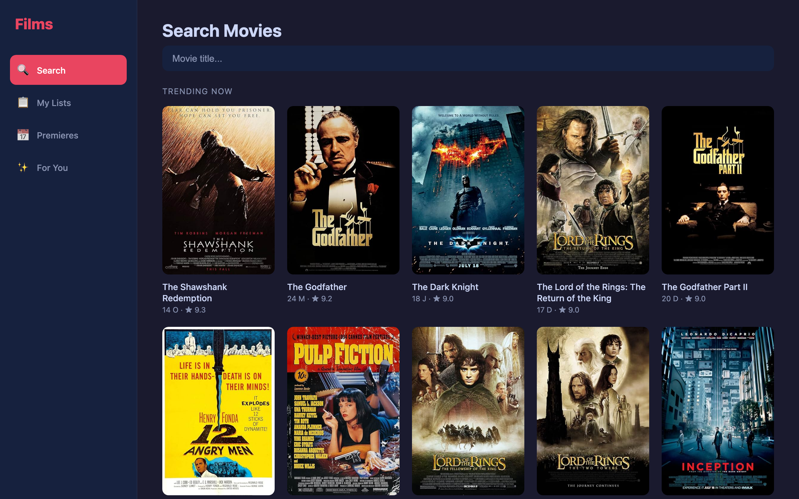
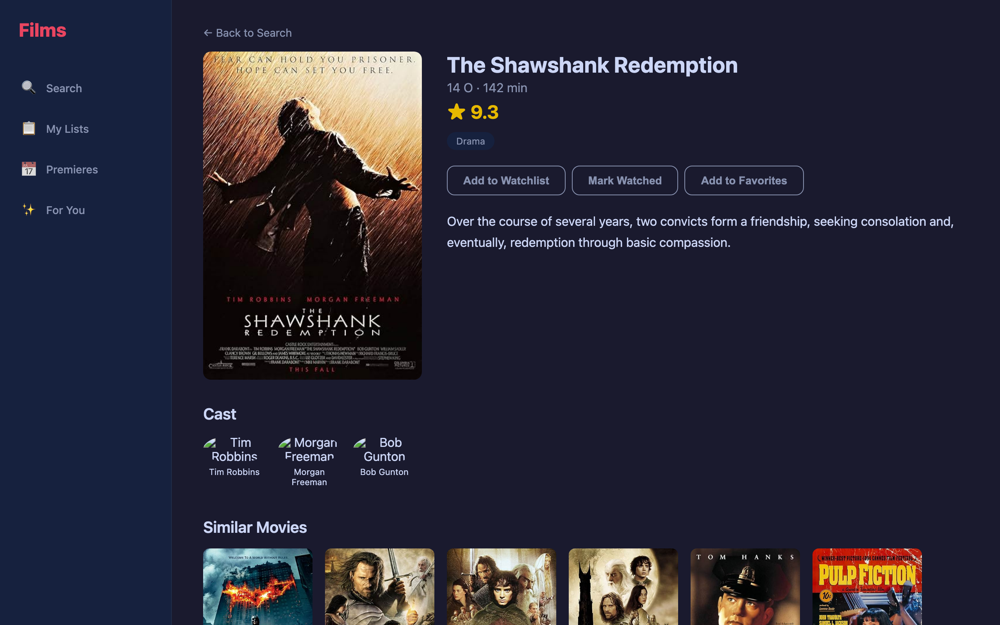
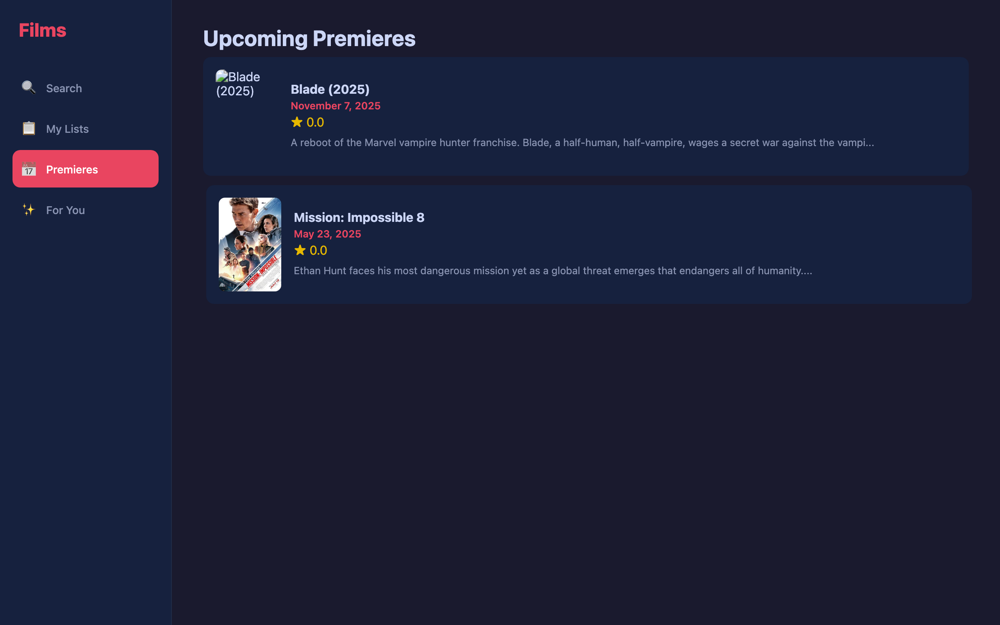
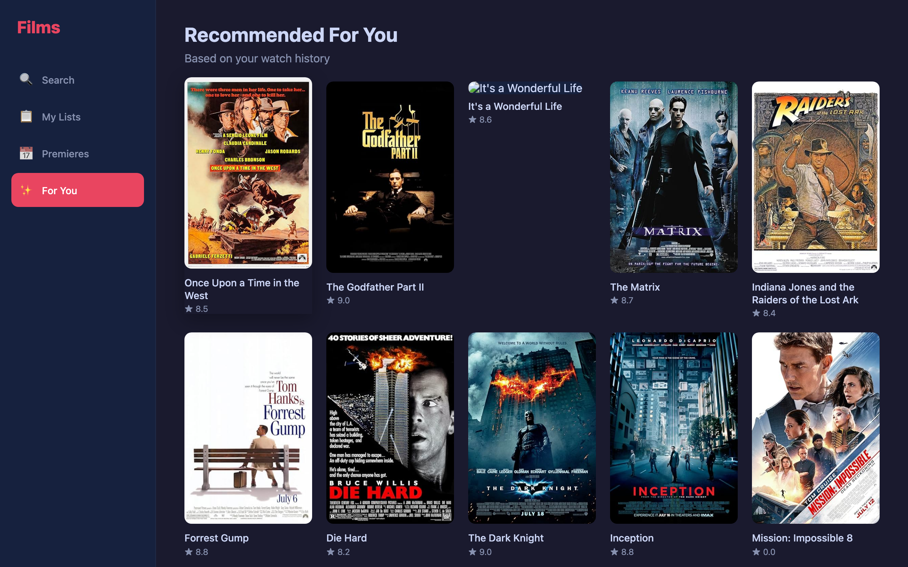
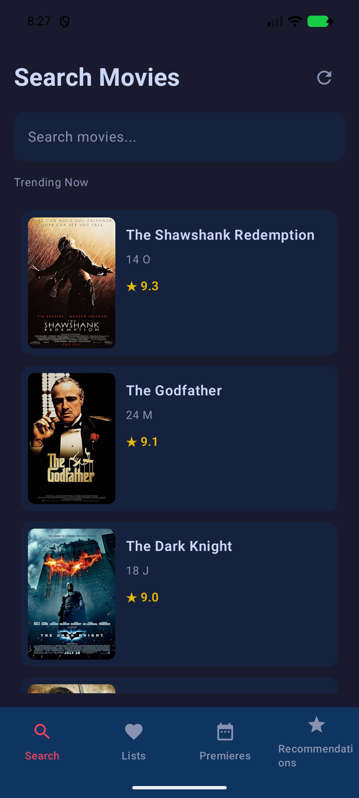
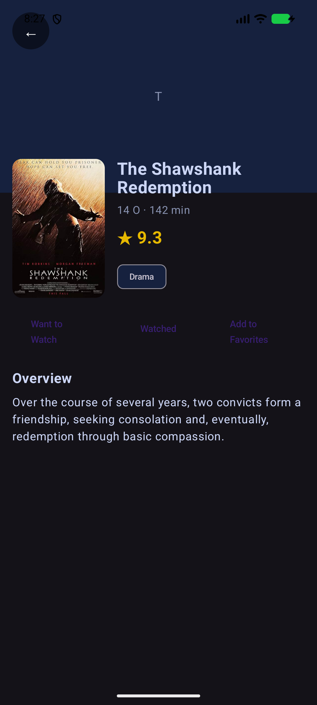

# Films — Movie Tracker & Planner

A cross-platform movie tracking app with recommendations, ratings, and premiere calendar. Built with **Kotlin Multiplatform (KMP)** + **Compose Multiplatform**, **React**, and a Node.js backend.

## Screenshots

### Web (React)





### Android (KMP)
| Search | Movie Detail |
|--------|-------------|
|  |  |

## Features

- **Search** 50 classic and trending movies (local database + OMDB API)
- **Trending** — top-rated films sorted by IMDB rating
- **Three lists** — Watchlist, Watched, Favorites
- **Ratings** (1–10), notes, tags
- **Sorting** — by date, rating, or title
- **Upcoming premieres** — Blade (2025), Mission Impossible 8, Deadpool & Wolverine, Dune: Part Two
- **Recommendations** — based on your watch history and genre preferences
- **Export** lists to CSV
- **Detailed movie pages** — description, cast, similar movies, genres
- **Dark theme** UI
- **Cross-platform** — Desktop (JVM), Web (React), Web (WasmJS), Android
- **PWA** — installable, offline support
- **Animations** — page transitions, hover effects
- **React Query** — cached API requests, optimistic updates

## Tech Stack

| Layer | Technology |
|-------|-----------|
| **Frontend (Web)** | React 18 + TypeScript + Vite |
| **Frontend (KMP)** | Kotlin Multiplatform + Compose Multiplatform |
| **Backend** | Node.js + Express + SQLite (sql.js) |
| **Movie Data** | Local database (50 films) + OMDB API |
| **State Management** | TanStack React Query |
| **Animations** | Framer Motion |
| **Desktop** | Compose Desktop (JVM) |
| **Web (WasmJS)** | Compose for Web |
| **Android** | Compose for Android |

## Quick Start

### 1. Backend

```bash
cd server
npm install
npm run dev
```

Server runs at `http://localhost:3001`

### 2. Web Client (React)

```bash
cd web
npm install
npm run dev
```

Open `http://localhost:5173`

### 3. Desktop App (KMP)

```bash
cd films-app
export JAVA_HOME=/opt/homebrew/opt/openjdk@17  # or your JDK 17+ path
./gradlew :desktop:run
```

### 4. Android App

```bash
cd films-app
export JAVA_HOME=/opt/homebrew/opt/openjdk@17
export ANDROID_HOME=~/Library/Android/sdk
./gradlew :android:installDebug   # installs on connected device/emulator
```

> The app works out of the box with a built-in local movie database and OMDB API for fresh poster images.

## KMP Project Structure

```
films-app/
├── shared/                      # Shared business logic (Kotlin Multiplatform)
│   └── src/commonMain/kotlin/com/films/shared/
│       ├── api/FilmsApi.kt      # HTTP client (Ktor)
│       ├── model/Models.kt      # Movie, UserMovie, Stats
│       └── ui/                  # Compose screens (shared across all platforms)
│           ├── SearchScreen.kt
│           ├── ListsScreen.kt
│           ├── CalendarScreen.kt
│           ├── RecommendationsScreen.kt
│           └── MovieDetailScreen.kt
├── desktop/                     # Desktop app (JVM)
├── web/                         # Web app (WasmJS)
├── android/                     # Android app
├── build.gradle.kts
├── settings.gradle.kts
└── gradlew
```

## Web Project Structure

```
web/
├── src/
│   ├── main.tsx                 # Entry point + React Query provider
│   ├── App.tsx                  # Router + lazy loading + animations
│   ├── index.css                # Global styles (dark theme)
│   ├── pages/
│   │   ├── SearchPage.tsx       # Search + trending
│   │   ├── ListsPage.tsx        # Watchlist/Watched/Favorites
│   │   ├── CalendarPage.tsx     # Upcoming premieres
│   │   ├── RecsPage.tsx         # Recommendations
│   │   └── MoviePage.tsx        # Movie detail
│   ├── services/
│   │   └── api.ts               # API client + types
│   └── types/
│       └── index.ts             # TypeScript interfaces
├── public/
│   ├── manifest.json            # PWA manifest
│   └── sw.js                    # Service worker
├── vite.config.ts               # Vite config + API proxy
└── package.json
```

## Backend Structure

```
server/
├── src/
│   ├── db.ts                    # SQLite database (sql.js) + debounced save
│   ├── local-movies.ts          # 50 curated films with full metadata
│   ├── routes/
│   │   ├── movies.ts            # User lists CRUD + export CSV + stats
│   │   └── tmdb.ts              # Movie search, trending, recommendations + pagination
│   └── index.ts                 # Express entry point
├── .env                         # OMDB API key
└── .env.example
```

## OMDB API

The app uses OMDB API for fresh movie poster images. The API key is configured in `server/.env`.

To get your own key:
1. Go to **http://www.omdbapi.com/apikey.aspx**
2. Select **FREE** (1,000 requests/day)
3. Enter your email
4. Add key to `server/.env`:
   ```
   OMDB_API_KEY=your_key_here
   ```

## License

MIT
